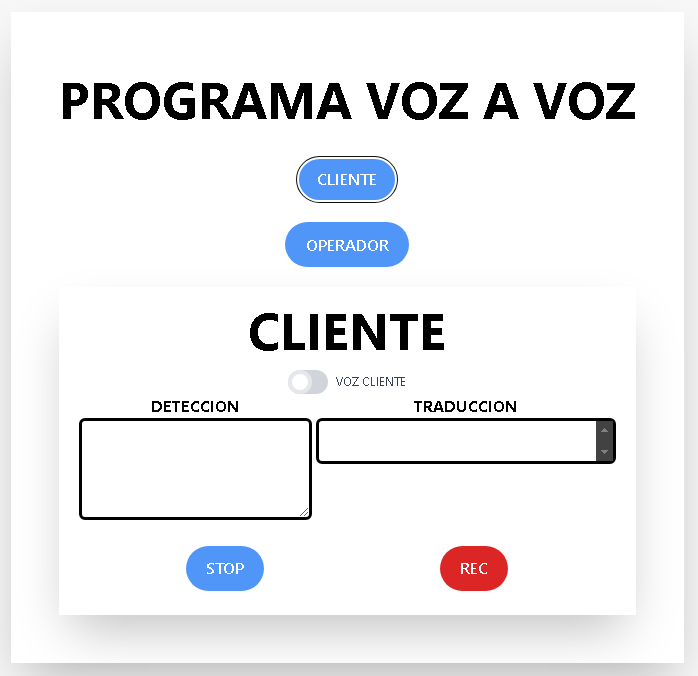
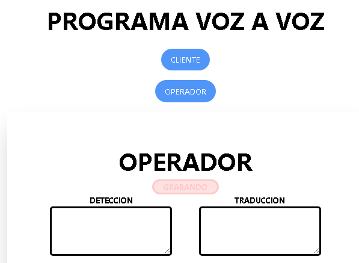
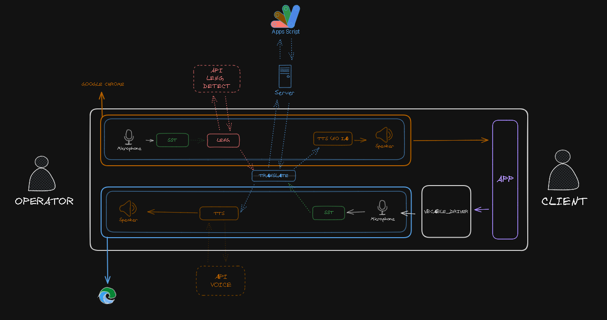
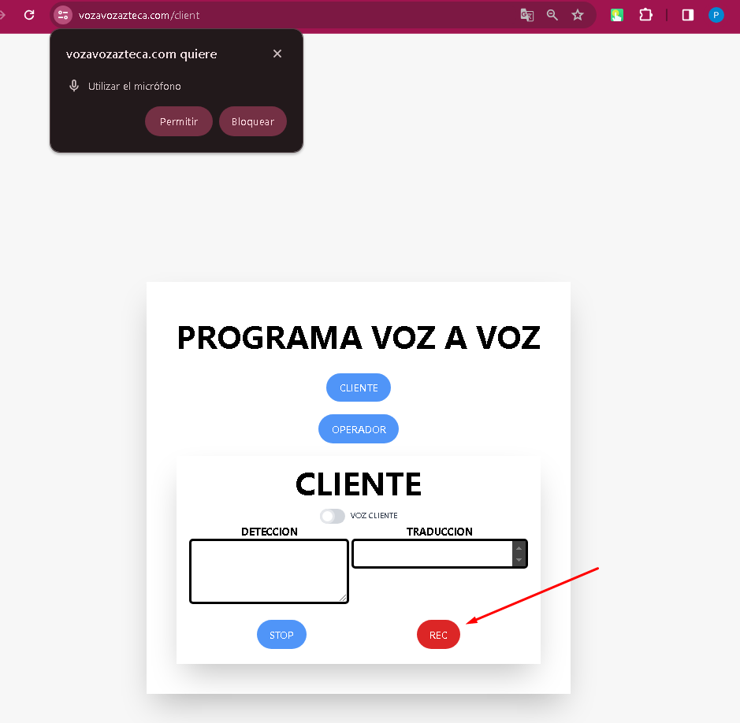
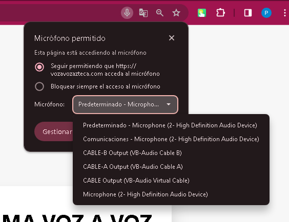
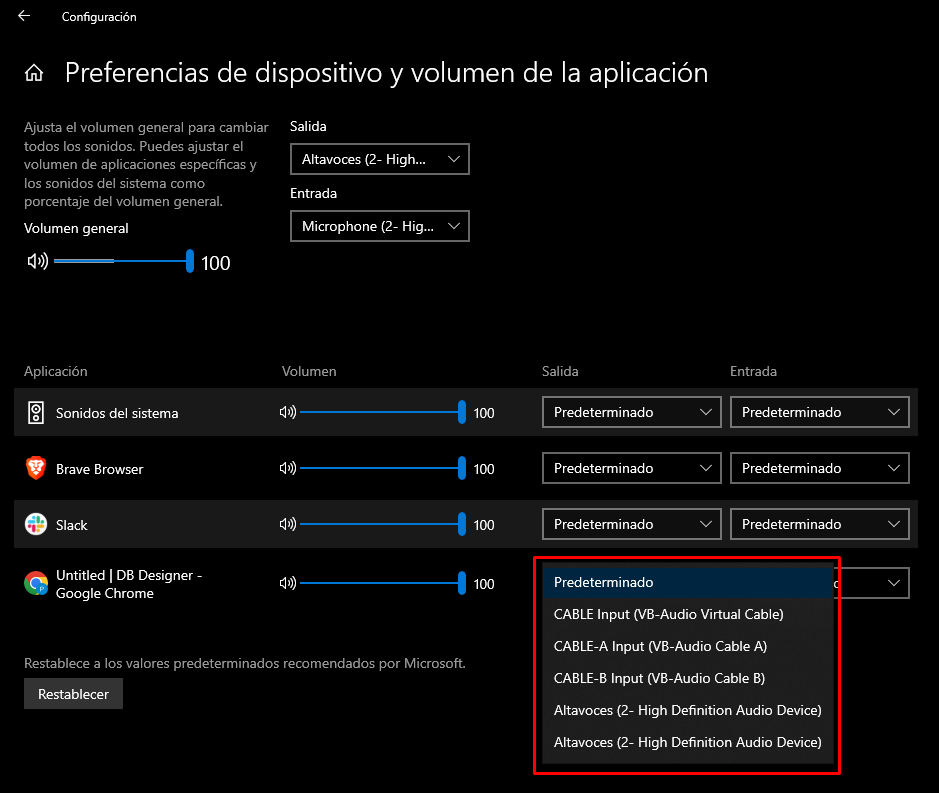

# Voz a Voz 

**Voz a Voz** es una herramienta diseñada para ofrecer traducciones en tiempo real de llamadas telefónicas, optimizando la comunicación entre distintos idiomas con un retraso mínimo. Es compatible con llamadas de la plataforma **Bitrix24** y videollamadas de **Zoom** y **Skype** gracias a controladores especializados.

- **Página oficial**: [Voz a Voz](https://vozavozazteca.com/)

## Compatibilidad de Navegadores

## Compatibilidad de Sistemas Operativos

## Funcionamiento General

El software opera siguiendo estos procedimientos:

1. Captura y traduce la voz del cliente, y simultáneamente la transcribe.
   
   

2. Captura y traduce la voz del operador, generando con IA una voz traducida al inglés.
   
   

## Integraciones y Plataformas

### Generación de Voz con IA
Utilizamos [VoiceMaker](https://voicemaker.in/) para generar voces a través de inteligencia artificial.

### Traducción en Tiempo Real
La traducción se lleva a cabo con [Apps Scripts](https://script.google.com/), un servicio de Google. Empleamos su función gratuita de traducción.

### Reconocimiento de Voz
El reconocimiento de voz es proporcionado por Google. Para integrarlo con React, usamos la siguiente librería:

- [Speech Recognition](https://www.npmjs.com/package/react-speech-recognition)

### Detección de Idioma
Usamos una API que identifica el idioma basándose en el texto. Esta información es esencial para la traducción:

- [Detect Language API](https://detectlanguage.com/)

### Configuración de Audio
[VB-Audio](https://shop.vb-audio.com/en/win-apps/12-vb-cable-ab.html) nos permite redireccionar el audio de una aplicación al navegador.

## Credenciales
Las credenciales se encuentran documentadas en:

- [Credenciales](./docs/Credenciales.pdf)

## Hosting

La aplicación está alojada en una VPS de Hostinger, que aloja tanto el frontend como el backend.

> ***IP del Servidor:*** 82.180.130.247

El frontend es administrado por un servidor **nginx**.

### Módulos Principales
- [GoogleTranslate](./src/modules/GoogleTranslate.jsx) - Traducción
- [LanguageDetection](./src/modules/LanguageDetection.jsx) - Detección de idioma
- [Speech_IA](./src/modules/Speech_IA.jsx) - Generación de voz con IA
- [SpeechGenerator](./src/modules/SpeechGenerator.jsx) - Transcripción de voz

## Diagrama de Flujo

A continuación, un esquema visual del flujo de datos en la aplicación:

## Instrucciones uso

Para el uso de este programa se necesita abrir en 2 navegadores diferente, uno para el ***Cliente*** y otro para el ***Operario***
> Mi recomendacion es usar ***Google Chrome*** y ***Microsoft Edge***

### Configuracion del navegador
1. Vamos a aceptar los permisos que nos solicita el navegador para utilizar el microfono

2. Luego vamos a asignar los dispositivos de escucha y audio

> Cliente: Vamos a asignar el ***CABLE-A***, 
significa que la web va a tomar todo el sonido que provenga de ese cable

> Operador: para el operador vamos a crear una configuracion de salida de audio en windows 10

3. Configuracion de windows 10 para el operador

Vamos a ir al panel de configuracion que nos prporciona windows 10 el cual nos permite redireccionar la salida de los navegadores. En el vamos a selecciona el ***CABLE-B*** el cual va a llevar el sonido llevado por el ***Operador*** por dicho cable.

4. Van a seleccionar una aplicacion de llamadas en la cual van a configurar: 
- la entrada de audio con el ***CABLE-B*** 
- la salida de audio con el ***CABLE-A***

## Consideraciones

- Asegúrate de instalar los controladores adecuados antes de ejecutar la aplicación.

- Recuerda mantener los dos navegadores abiertos a la hora de realizar las llamadas

## Conclusión

El programa **Voz a Voz** simplifica la comunicación entre idiomas, permitiendo traducciones fluidas en tiempo real.

---

*Este documento ofrece una panorámica del software. Para información detallada, se sugiere revisar el código fuente y sus comentarios.*
